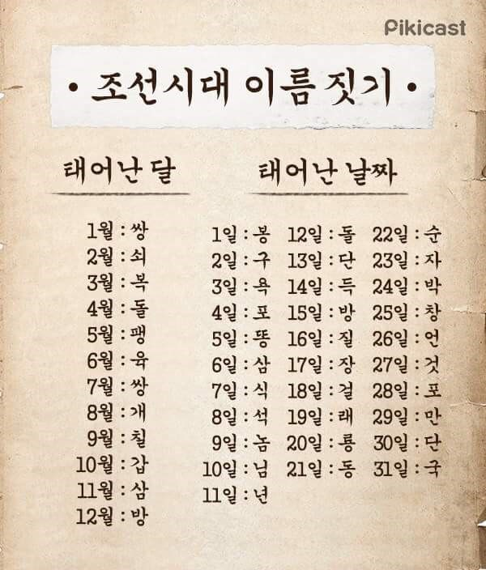

# 과제 4: 나의 조선시대 이름 찾기

성(```family name```), 태어난 달(```month```)과 태어난 날짜(```day```)를 입력받아 나의 조선시대 이름을 출력하는 함수를 작성하시오.
* 함수명: ```get_my_chosun_name()```
* 매개변수: ```family_name, month, day```



1. 태어난 달(```month```)에 해당되는 이름의 첫번째 글자를 구하기 위한 리스트를 생성하시오.

### 출력 결과:
```
['쌍', '쇠', '복', '돌', '팽', '육', '쌍', '개', '칠', '갑', '삼', '방']
```

2. 태어난 날짜(```day```)에 해당되는 이름의 두번째 글자를 구하기 위한 리스트를 생성하시오.

### 출력 결과:
```
['봉', '구', '욕', '포', '똥', '삼', '식', '석', '놈', '님', '년', '돌', '단', '득', '방', '질', '장', '걸', '래', '룡', '동', '순', '자', '박', '창', '언', '것', '포', '만', '단', '국']
```

3. 나의 조선시대 이름을 문자열로 반환하는 함수 ```get_my_chosun_name()``` 을 작성하시오.

4. 완성된 함수를 호출하여 나의 조선시대 이름을 출력하시오.

* 예: ```get_my_chosun_name('안', 9, 18)```

### 출력 결과:
```
당신의 조선시대 이름은 안칠걸 입니다.
```
