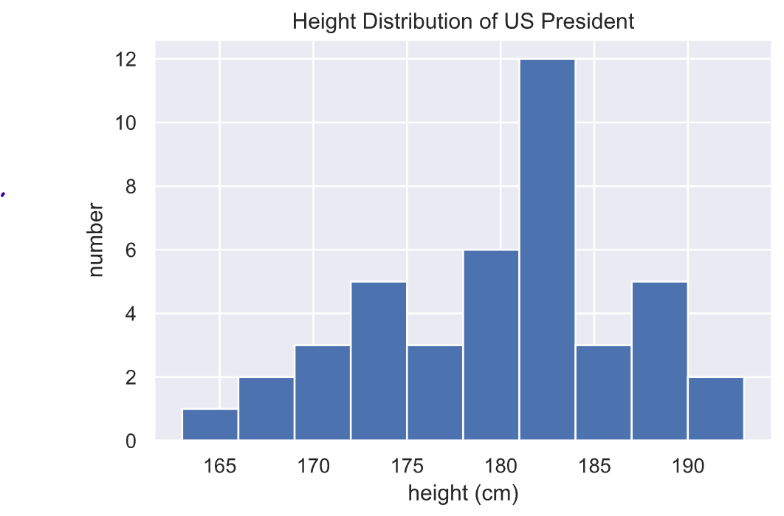

# 과제 5: 미국 대통령들의 키는 얼마나 컸을까?

역대 미국 대통령들의 신장(height) 데이터 ```president_height.csv``` 가 있습니다.

해당 데이터를 이용하여 역대 대통령들의 키와 관련된 기술통계(descriptive statistics) 분석을 수행하고 그 결과를 시각화하세요.

- 출처: https://github.com/jakevdp/PythonDataScienceHandbook

## 준비사항
### 필수 라이브러리 설치

1. 과제 수행에 필요한 라이브러리(```numpy, pandas, matplotlib, seaborn```)들을 모두 설치하세요(이미 설치되어 있는 상태면 skip).

- 설치방법 1: jupyter lab 브라우저의 독립된 셀에서 설치 명령어 실행(셀 안에 명령어 외의 다른 코드 포함 X)
- 설치방법 2: Anaconda->Environments->Open Terminal 실행 후 터미널에서 설치 명령어 실행

#### 예: pandas 설치 명령어
```pip install pandas```

### 신장 데이터 저장

2. 다음 링크에 접속하여 미국 대통령들의 신장 데이터를 다운로드하여, Jupyter Lab 작업 폴더 밑의 ```data``` 폴더에 저장하세요.

- 신장 데이터 파일 링크: [president_height.csv](https://github.com/gurami85/lectures/blob/main/data/president_heights.csv)
- 해당 페이지에서 'Raw' 메뉴 클릭하여 파일 텍스트 내용을 확인
- 우클릭->다른이름으로 저장->```president_heights.csv``` 파일이름으로 저장
- Jupyter Lab 에서 ```data``` 폴더 생성
- ```president_heights.csv``` 를 생성한 ```data``` 폴더에 복사

## 기술통계 및 시각화

### 데이터 로딩

3. 다운로드 받은 데이터를 로딩하기 위해 Jupyter Lab에서 ```numpy``` 와 ```pandas``` 를 임포트하세요.

```python3
import pandas as pd
import numpy as np
```

4. ```pandas``` 라이브러리를 이용하여 신장 데이터(```president_heights.csv```)를 불러오세요.

```python3
data = pd.read_csv('data/president_heights.csv')
```

5. 데이터 불러오기가 정상적으로 완료되었다면  ```data.head()``` 코드를 실행하여 데이터의 일부를 출력하세요.

#### 예상 출력결과:

|order|name|height(cm)|
|---|---|---|
|1|George Washington|189|
|2|John Adams|170|
|3|Thomas Jefferson|189|
|4|James Madison|163|
|5|James Monroe|183|

위와 같이 ```data``` 는 미국 역대 대통령들의 순서(```order```), 이름(```name```), 그리고 신장(```height(cm)```)과 같이 총 3 개의 변수들로 구성되어 있습니다.

6. 다음의 코드를 실행하여 전체 데이터로부터 신장 값들만 저장하는 ```numpy``` 배열을 선언하세요.

```python3
heights = np.array(data['height(cm)'])
print(heights)
```

#### 예상 출력결과:

```
[189 170 189 163 183 171 185 168 173 183 173 173 175 178 183 193 178 173
 174 183 183 168 170 178 182 180 183 178 182 188 175 179 183 193 182 183
 177 185 188 188 182 185]
```

### 기술통계

7. 배열로 저장한 신장 데이터(```heights```)에 대해 ```numpy```에서 제공하는 집계함수들을 이용하여 기술통계를 수행하세요.

#### 예상 출력결과:

```
Mean height = 179.73809523809524
Standard deviation = 6.931843442745892
Minimum height = 163
Maximum height = 193
25th percentile = 174.25
Median = 182.0
75th percentile = 183.0
```

8. ```heights``` 로부터 키가 가장 큰 대통령의 인덱스와 가장 작은 대통령의 인덱스를 각각 ```max_idx```, ```min_idx``` 변수에 저장 및 출력하세요.

#### 예상 출력결과:

```
max_idx = 15
min_idx = 3
```

9. ```max_idx```와 ```min_idx``` 변수를 사용하여 키가 가장 큰/가장 작은 대통령들의 이름을 출력하세요.

```python3
max_name = data.iloc[max_idx]['name']
min_name = data.iloc[min_idx]['name']

print("The tallest president is", max_name)
print("The smallest president is", min_name)
```

#### 예상 출력결과:

```
The tallest president is Abraham Lincoln
The smallest president is James Madison
```

### 시각화

10. 신장 데이터 ```heights``` 를 시각화하기 위해 ```matplotlib.pyplot```과 ```seaborn```을 임포트하세요.

```python3
from matplotlib import pyplot as plt
import seaborn
```

11. 다음의 코드를 통해 시각화 옵션을 설정하고 신장 데이터 ```heights```의 히스토그램을 시각화하여, 역대 미국 대통령들의 키 분포가 어떻게 되는지 확인하세요.

```python3
%matplotlib inline
%config InlineBackend.figure_format = 'svg'
seaborn.set()

plt.hist(heights)
plt.title('Height Distribution of US President')
plt.xlabel('height (cm)')
plt.ylabel('number')
plt.show()
```


